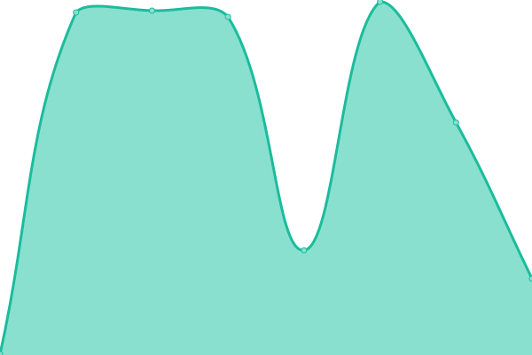

# [📈 Live Status](https://blinkergit.github.io/upptime): <!--live status--> **🟩 All systems operational**

This repository contains the open-source uptime monitor and status page for [blinkergit](https://blinkergit.github.io/upptime), powered by [Upptime](https://github.com/upptime/upptime).

With [Upptime](https://upptime.js.org), you can get your own unlimited and free uptime monitor and status page, powered entirely by a GitHub repository. We use [Issues](https://github.com/blinkergit/upptime/issues) as incident reports, [Actions](https://github.com/blinkergit/upptime/actions) as uptime monitors, and [Pages](https://blinkergit.github.io/upptime) for the status page.

<!--start: status pages-->
<!-- This summary is generated by Upptime (https://github.com/upptime/upptime) -->
<!-- Do not edit this manually, your changes will be overwritten -->
<!-- prettier-ignore -->
| URL | Status | History | Response Time | Uptime |
| --- | ------ | ------- | ------------- | ------ |
|  [Violet Prod](https://violet.blinker-prod.com) | 🟩 Up | [violet-prod.yml](https://github.com/BlinkerGit/upptime/commits/HEAD/history/violet-prod.yml) | 

 326ms
     
 | 

<a href="https://blinkergit.github.io/upptime/history/violet-prod">100.00%</a>
    

|  [Violet Stage](https://violet.blinker-stage.com) | 🟩 Up | [violet-stage.yml](https://github.com/BlinkerGit/upptime/commits/HEAD/history/violet-stage.yml) | 

 333ms
     
 | 

<a href="https://blinkergit.github.io/upptime/history/violet-stage">100.00%</a>
    

|  [Violet Dev](https://violet.blinker-dev.com) | 🟩 Up | [violet-dev.yml](https://github.com/BlinkerGit/upptime/commits/HEAD/history/violet-dev.yml) | 

 332ms
     
 | 

<a href="https://blinkergit.github.io/upptime/history/violet-dev">100.00%</a>
    

<!--end: status pages-->

[**Visit our status website →**](https://blinkergit.github.io/upptime)

## 📄 License

- Powered by: [Upptime](https://github.com/upptime/upptime)
- Code: [MIT](./LICENSE) © [blinkergit](https://blinkergit.github.io/upptime)
- Data in the `./history` directory: [Open Database License](https://opendatacommons.org/licenses/odbl/1-0/)
